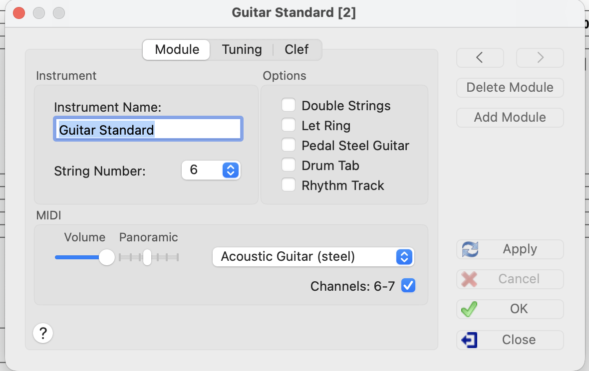
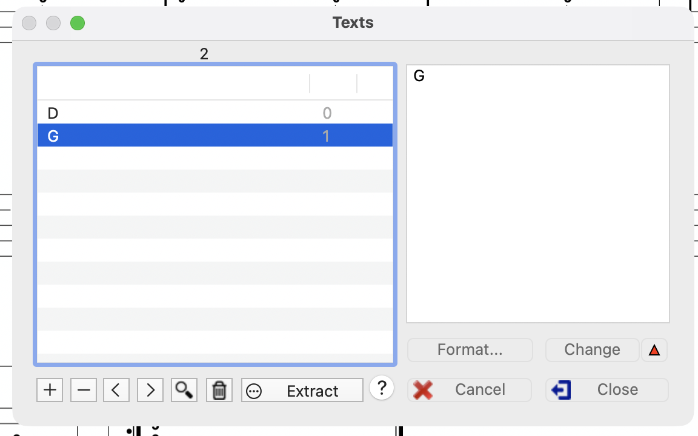
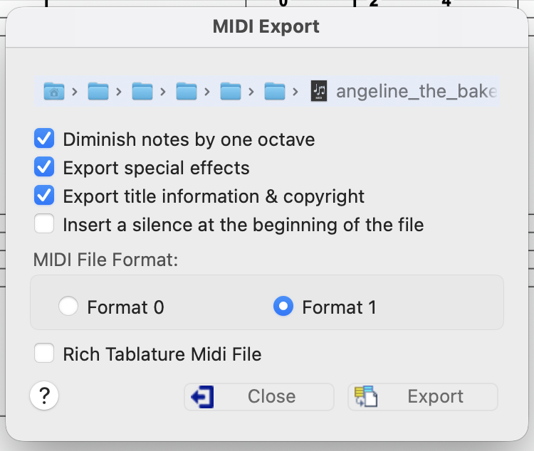
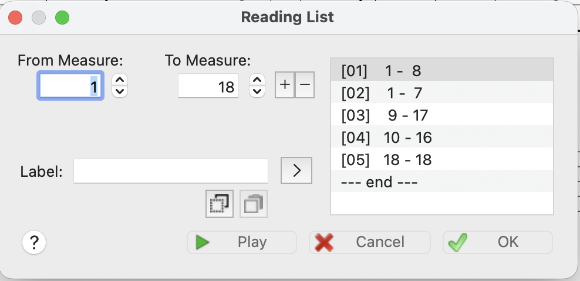

# Angeline The Baker

The full song angeline the baker has several features which are progressively documented and
stripped out of the truth file.

**Bound to the MIDI Module -- maybe?**
- Different modules (guitar and banjo)
- Playback "reading lists" which implement A/B parts and repeated phrases.

**Bound to the "note data" -- maybe?**
- Fingerings
- Annotations

## Modules

Instruments are stored as "Modules" - is there a midi concept?

Modules appear to have some kind of associated indexing. For example, Angeline guitar is module [2].

## Annotations

Notes can have text annotations, fingerings, and other dressings. This file does not have fingering
annotation. Fingering annotation comes in a few flavors, including which finger plucks and which
finger frets - frets are stored as numbers, and fingerings are stored as letters.

Here's an annotation that shows a text annotation (often used to indicate a chord that the melody is
playing with).

Text annotations seem to be stored in two ways - there is possibly a storage area that stores the
total unique annotations, and there seems to be an association of repeating the annotations inline
with tableture. For example - G or D is used over and over to indicate chord changes.

## MIDI Export

There is a translation layer that moves special tabledit features like hammerons or chokes (bends)
and translates them into MIDI features. There also seems to be some octave transposition that
happens on export.

## MIDI Reading List

Here's an example of reading lists - which dictate the order and groupings of playaback of MIDI
data.

